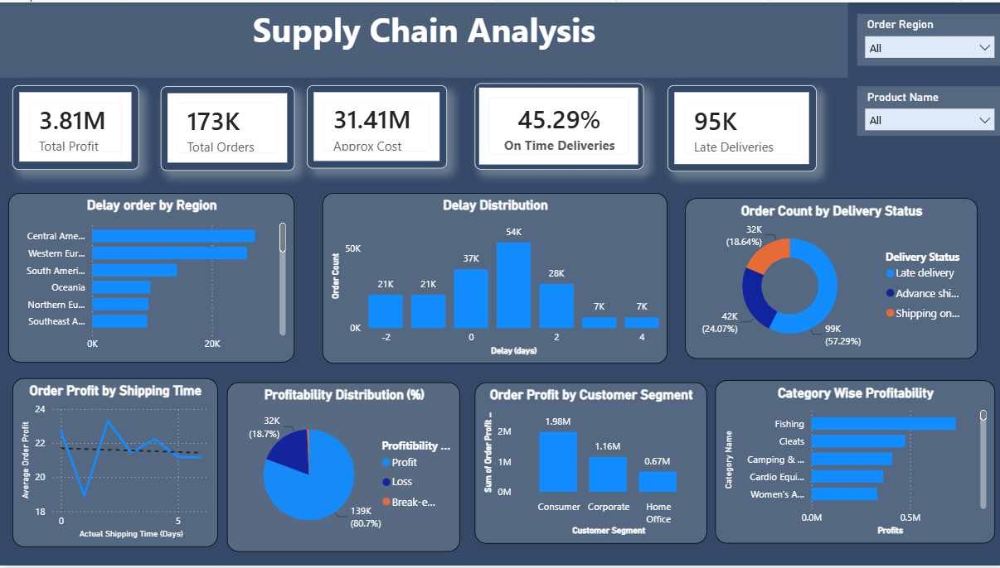

# Supply Chain Analysis 

An interactive **Power BI dashboard** for analyzing supply chain performance, delivery delays, profitability, and regional trends using the **DataCo Smart Supply Chain dataset**.

The project focuses on understanding how delivery performance varies across regions, product categories, customer segments, and shipping times, while identifying areas where delays and profitability issues may affect overall supply chain performance.

---


## 📊 Dashboard Preview



---

## 🎯 Project Objectives

The main objectives of this project are to:

* Analyze overall order and delivery performance
* Identify regions with high numbers of delayed orders
* Examine the relationship between shipping time and order profitability
* Compare profitability across product categories and customer segments
* Analyze the distribution of early and late deliveries
* Monitor key supply chain KPIs through an interactive dashboard

---

## 📌 Key Performance Indicators

| KPI                      | Description                                     |
| ------------------------ | ----------------------------------------------- |
| **Total Profit**         | Sum of `Order Profit Per Order`                 |
| **Total Orders**         | Total number of orders                          |
| **Approx Cost**          | `Sales - Order Profit Per Order`                |
| **On-Time Deliveries %** | Percentage of orders delivered on time or early |
| **Late Deliveries**      | Number of orders with a positive delay          |

---

## 📈 Dashboard Visualizations

### 1. Order Profit by Shipping Time

Shows how average order profit changes with actual shipping time and helps identify potential relationships between shipping duration and profitability.

### 2. Delay Orders by Region

Compares the number of delayed orders across different order regions to identify areas with higher delivery delays.

### 3. Delay Distribution

Shows the distribution of delivery delays in days, including early, on-time, and late deliveries.

### 4. Order Count by Delivery Status

Displays the distribution of orders across different delivery statuses.

### 5. Profitability Distribution

Breaks down orders into:

* Profit
* Loss
* Break-even

based on the `Profitibility Flag`.

### 6. Order Profit by Customer Segment

Compares total order profit across different customer segments.

### 7. Category-wise Profitability

Shows total profit generated by individual product categories and highlights categories with stronger or weaker profitability.

---

## 🔎 Key Insights

The analysis provides several useful observations:

* Approximately **55% of orders arrive late** relative to the scheduled shipping window.
* Delivery delays vary considerably across different regions.
* Profitability is concentrated in certain product categories, while some categories generate relatively lower or negative profit.
* Customer segments contribute differently to overall profitability.
* Shipping time does not always have a direct relationship with order profit, suggesting that factors beyond delivery duration may influence profitability.
* The dashboard allows users to investigate these patterns interactively using product and regional filters.

> **Note:** The exact insights may change when different filters are applied.

---

## 🧹 Data Preparation

The original DataCo Smart Supply Chain dataset was cleaned and prepared before importing it into Power BI.

The cleaned dataset includes several derived fields, including:

* `Delay`
* `Is_Delayed`
* `order_month`
* `order_hour`
* `order_day`
* `Profitibility Flag`

The `Delay` field is used to determine whether an order was delivered early/on time or late.

### Delay Logic

* `Delay <= 0` → On Time / Early
* `Delay > 0` → Late

---

## 🧮 DAX Measures

### Total Profit

```DAX
Total Profit =
SUM('DataCo_Cleaned'[Order Profit Per Order])
```

### Total Orders

```DAX
Total Orders =
COUNTROWS('DataCo_Cleaned')
```

### Late Deliveries

```DAX
Late Deliveries =
CALCULATE(
    COUNTROWS('DataCo_Cleaned'),
    'DataCo_Cleaned'[Delay] > 0
)
```

### On-Time Delivery %

```DAX
On Time % =
1 - DIVIDE(
    [Late Deliveries],
    [Total Orders]
)
```

### Late Delivery %

```DAX
Late Delivery % =
DIVIDE(
    [Late Deliveries],
    [Total Orders]
)
```

### Approximate Cost

```DAX
Approx Cost =
SUM('DataCo_Cleaned'[Sales])
-
SUM('DataCo_Cleaned'[Order Profit Per Order])
```

> **Note:** `Approx Cost` is an estimated value because the dataset does not contain a direct logistics/total-cost field.

---

## 🎛️ Dashboard Filters

The dashboard includes interactive slicers for:

* **Product Name**
* **Order Region**

These filters allow users to explore supply chain performance for specific products and regions.

---

## 🗂️ Dataset

### Source

**DataCo Smart Supply Chain Dataset**

### Files

```text
Supply-Chain-Analysis/
│
├── assets/
│   └── dashboard.png
│
|── cleaning_eda.ipynb
├── DataCoSupplyChainDataset.csv
├── DataCo_Cleaned.csv
└── README.md
```

* `DataCoSupplyChainDataset.csv` — Original dataset
* `DataCo_Cleaned.csv` — Cleaned dataset used for the dashboard
* `assets/dashboard.png` — Dashboard preview image

---

## 🛠️ Tools & Technologies

* **Microsoft Excel** — Data cleaning and feature/derived column creation
* **Power BI Desktop** — Data modeling, DAX calculations, interactive dashboard development
* **DAX** — KPI and analytical measure creation

---

## 🔄 Project Workflow

```text
Raw Data
   ↓
Data Cleaning & Preparation
   ↓
Derived Columns
   ↓
Power BI Data Import
   ↓
DAX Measures
   ↓
Data Analysis
   ↓
Interactive Dashboard
   ↓
Supply Chain Insights
```

---

## 🚀 How to Use

1. Clone this repository.
2. Open `DataCo_Cleaned.csv` in Power BI Desktop.
3. If necessary, update the dataset path in Power BI.
4. Load or refresh the data.
5. Explore the dashboard using the **Product Name** and **Order Region** slicers.
6. Analyze delivery performance, profitability, and regional trends.

---

## 💡 Business Questions Answered

This dashboard helps answer questions such as:

* What percentage of orders are delivered late?
* Which regions have the highest number of delayed orders?
* How does shipping time relate to order profitability?
* Which product categories generate the most profit?
* Which customer segments contribute most to profitability?
* How are orders distributed across delivery statuses?
* What proportion of orders are profitable, loss-making, or break-even?

---

## 📷 Dashboard

The final dashboard combines delivery performance, profitability, and regional analysis into a single interactive Power BI report.

**Built with Microsoft Power BI, Excel, and DAX.**
